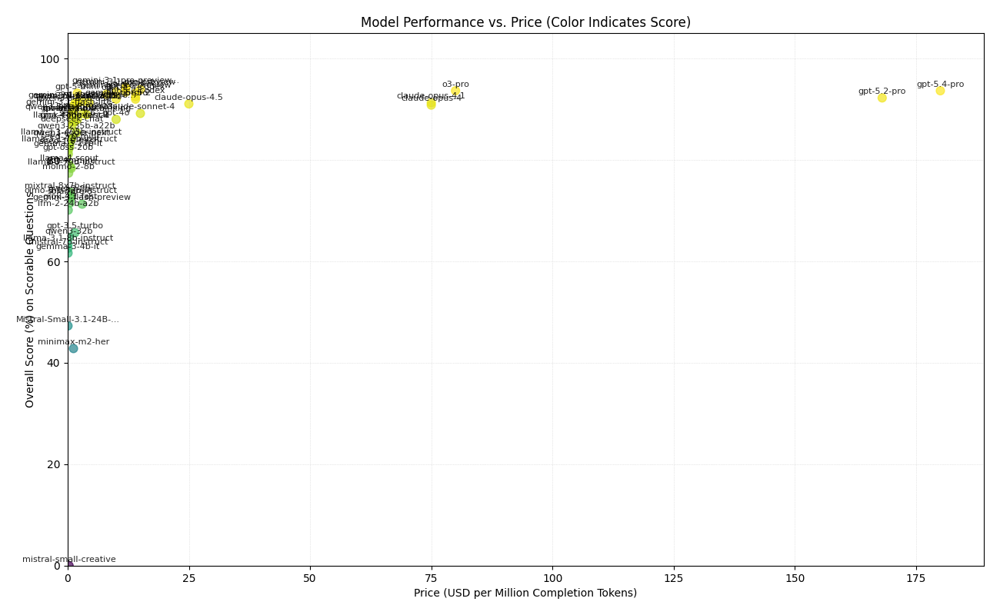

# Leaderboard

## Price x Performance

| Model Name                                    | Overall Score | Access      | Date Tested | Price ($/Mtok) | V1 Benchmark Questions | Community Questions Fbn | Crop Management | Nutrient Management | Pest Management | Soil And Water |
|----------------------------------------------|---------------|------------|-------------|----------------|------------------------|-------------------------|-----------------|---------------------|-----------------|----------------|
| openai/o3-pro                                 |         93.65% | Open Source | 2025-08-11  |    $80.0000    |                  91.4% |                   92.0% |           94.1% |               94.1% |           91.9% |          97.5% | (398/425)
| openai/gpt-5                                  |         93.41% | Open Source | 2025-08-11  |    $10.0000    |                  92.4% |                   92.0% |           95.6% |               94.1% |           91.9% |          93.8% | (397/425)
| openai/gpt-5-mini                             |         93.18% | Open Source | 2025-08-11  |    $2.0000     |                  92.4% |                   72.0% |           95.6% |               94.1% |           95.2% |          96.2% | (396/425)
| openai/o3                                     |         92.94% | Open Source | 2025-08-11  |    $8.0000     |                  90.5% |                   88.0% |           94.1% |               94.1% |           91.9% |          96.2% | (395/425)
| google/gemini-2.5-pro                         |         92.00% | Proprietary | 2025-08-11  |    $10.0000    |                  90.5% |                   80.0% |           97.1% |               89.4% |           95.2% |          93.8% | (391/425)
| anthropic/claude-opus-4.1                     |         91.29% | Open Source | 2025-08-05  |    $75.0000    |                  88.6% |                   88.0% |           92.7% |               92.9% |           88.7% |          95.0% | (388/425)
| openai/o4-mini-high                           |         91.29% | Proprietary | 2025-08-05  |    $4.4000     |                  87.6% |                   80.0% |           94.1% |               95.3% |           88.7% |          95.0% | (388/425)
| anthropic/claude-opus-4                       |         90.82% | Proprietary | 2025-05-22  |    $75.0000    |                  88.6% |                   92.0% |           91.2% |               91.8% |           87.1% |          95.0% | (386/425)
| openai/gpt-oss-120b                           |         88.94% | Open Source | 2025-08-05  |    $0.2904     |                  88.6% |                   84.0% |           89.7% |               89.4% |           87.1% |          91.2% | (378/425)
| openai/gpt-4o                                 |         88.00% | Proprietary | 2025-04-27  |    $10.0000    |                  86.7% |                   80.0% |           88.2% |               87.1% |           88.7% |          92.5% | (374/425)
| norm                                          |         87.53% | Proprietary | 2025-04-27  |      N/A       |                  89.5% |                   76.0% |           89.7% |               85.9% |           87.1% |          88.8% | (372/425)
| meta-llama/llama-4-maverick                   |         87.53% | Open Source | 2025-04-27  |    $0.5000     |                  89.5% |                   84.0% |           88.2% |               84.7% |           88.7% |          87.5% | (372/425)
| deepseek/deepseek-chat                        |         86.82% | Open Source | 2025-04-27  |    $0.7201     |                  89.5% |                   72.0% |           83.8% |               89.4% |           88.7% |          86.2% | (369/425)
| qwen/qwen3-235b-a22b                          |         85.41% | Proprietary | 2025-05-16  |    $0.6000     |                  88.6% |                   68.0% |           88.2% |               83.5% |           85.5% |          86.2% | (363/425)
| meta-llama/llama-3.1-405b-instruct            |         84.24% | Open Source | 2025-04-27  |    $0.8000     |                  88.6% |                   68.0% |           88.2% |               85.9% |           83.9% |          78.8% | (358/425)
| meta-llama/llama-3.1-70b-instruct             |         82.82% | Open Source | 2025-04-27  |    $0.2800     |                  83.8% |                   72.0% |           89.7% |               81.2% |           87.1% |          77.5% | (352/425)
| google/gemma-3-27b-it                         |         81.88% | Open Source | 2025-05-23  |    $0.1700     |                  84.8% |                   60.0% |           80.9% |               80.0% |           83.9% |          86.2% | (348/425)
| openai/gpt-oss-20b                            |         81.18% | Open Source | 2025-08-05  |    $0.1500     |                  83.8% |                   52.0% |           83.8% |               83.5% |           80.7% |          82.5% | (345/425)
| meta-llama/llama-4-scout                      |         79.06% | Open Source | 2025-04-27  |    $0.3000     |                  80.0% |                   60.0% |           79.4% |               78.8% |           82.3% |          81.2% | (336/425)
| openai/gpt-4o-mini                            |         78.59% | Proprietary | 2025-04-27  |    $0.6000     |                  78.1% |                   72.0% |           82.3% |               74.1% |           75.8% |          85.0% | (334/425)
| meta-llama/llama-3-70b-instruct               |         78.35% | Open Source | 2025-04-27  |    $0.4000     |                  83.8% |                   52.0% |           80.9% |               77.7% |           80.7% |          76.2% | (333/425)
| mistralai/mixtral-8x7b-instruct               |         73.65% | Open Source | 2025-04-27  |    $0.2400     |                  79.0% |                   48.0% |           76.5% |               68.2% |           77.4% |          75.0% | (313/425)
| qwen/qwen3-8b                                 |         72.94% | Proprietary | 2025-05-16  |    $0.1380     |                  77.1% |                   52.0% |           69.1% |               67.1% |           72.6% |          83.8% | (310/425)
| dhenu2-in-8b-preview                          |         66.82% | Proprietary | 2025-04-27  |      N/A       |                  71.4% |                   52.0% |           64.7% |               61.2% |           71.0% |          70.0% | (284/425)
| openai/gpt-3.5-turbo                          |         65.65% | Proprietary | 2025-04-27  |    $1.5000     |                  73.3% |                   32.0% |           67.7% |               62.4% |           69.3% |          65.0% | (279/425)
| qwen/qwen3-32b                                |         64.71% | Proprietary | 2025-05-16  |    $0.0720     |                  64.8% |                   56.0% |           61.8% |               65.9% |           72.6% |          62.5% | (275/425)
| meta-llama/llama-3.1-8b-instruct              |         63.29% | Open Source | 2025-04-27  |    $0.0200     |                  66.7% |                   68.0% |           67.7% |               48.2% |           64.5% |          68.8% | (269/425)
| mistralai/mistral-7b-instruct                 |         62.59% | Open Source | 2025-04-27  |    $0.0540     |                  61.9% |                   36.0% |           75.0% |               52.9% |           69.3% |          66.2% | (266/425)
| google/gemma-3-4b-it                          |         61.65% | Open Source | 2025-04-27  |    $0.0400     |                  62.9% |                   48.0% |           67.7% |               54.1% |           69.3% |          61.2% | (262/425)
| gbstox/gemma3-4b-agrosirus200k-merged         |         50.82% | Open Source | 2025-05-23  |      N/A       |                  50.5% |                   40.0% |           54.4% |               45.9% |           53.2% |          55.0% | (216/425)
| mistralai/Mistral-Small-3.1-24B-Instruct-2503 |         47.29% | Proprietary | 2025-05-17  |    $0.0720     |                  44.8% |                   32.0% |           51.5% |               45.9% |           50.0% |          51.2% | (201/425)

# What is this?
We are benchmarking the ability for different models to give correct answers to Agronomy questions. This is a simple, 98 multiple-choice question benchmark today, and I plan to make it more complete and challenging in the future.

# Why?
When building new models for agriculture, it's important to know if your model is getting better or worse. This is a simple benchmark to help us determine if we are improving the agronomic ability of new models and by how much.

# Roadmap
1. Make it harder! These are fairly basic questions. We should add short and long answer questions (to be evaluated against example correct answers)
2. Add questions for international regions
3. Add more models to the leaderboard

# Updates

## 2025-04-27
1. Refactored code to simplify & make easier to maintain.
2. Added price vs performance graph
3. Fixed several formatting issues in the results display
4. Added models

## 2024-08-16
1. Thank you to Farmers Business Network, who contributed community questions!
2. Benchmarks have been run against the new community questions on select models.
3. Nous Hermes 3 405b added & benchmarked.

## 2024-07-24
1. Added Meta Llama 3.1 models
2. Added OpenAI GPT4o-mini

## 2024-06-15
1. Added 295 more questions to the benchmark.
2. Added quesiton cateogires
3. Re-ran with all models
4. Added graphs as output for visual comparison. 

## 2024-01-17
1. Updated benchmark questions to remove incorrectly formed questions (for eaxample, the most missed question across all models was "e. both symptoms occur across the field and stunted roots", which is clearly not a properly formed question). 

2. Included chat prompt templates for models that require chat templates. 

3. Re-ran benchmark against all models after fixes in place and updated leaderboard.

