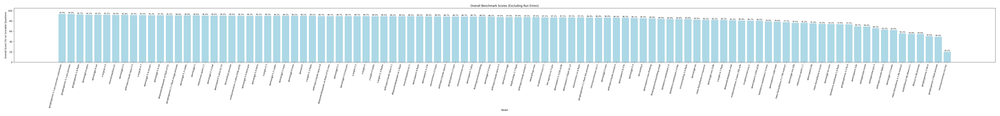
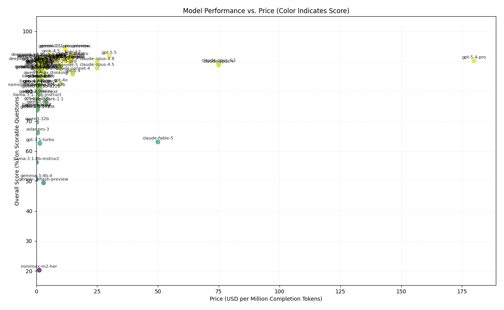

# Leaderboard

## Price x Performance

| Model Name                                | Overall Score | Access      | Date Tested | Price ($/Mtok) | Community Questions Fbn | Crop Management | Image Disease | Image Pest | Image Weed | Nutrient Management | Pest Management | Soil And Water | V1 Benchmark Questions |
|------------------------------------------|---------------|------------|-------------|----------------|-------------------------|-----------------|---------------|------------|------------|---------------------|-----------------|----------------|------------------------|
| google/gemini-3.1-pro-preview-customtools |         93.88% | Proprietary | 2026-07-09  |    $12.0000    |                   92.0% |           94.1% |         72.0% |      68.0% |      82.0% |               95.3% |           95.2% |          95.0% |                  91.4% | (399/425)
| google/gemini-3.1-pro-preview             |         93.88% | Proprietary | 2026-07-09  |    $12.0000    |                   96.0% |           94.1% |         72.0% |      66.0% |      84.0% |               95.3% |           93.5% |          93.8% |                  92.4% | (399/425)
| x-ai/grok-4.5                             |         92.24% | Proprietary | 2026-07-09  |    $6.0000     |                   92.0% |           94.1% |         54.0% |      62.0% |      76.0% |               92.9% |           90.3% |          96.2% |                  88.6% | (392/425)
| moonshotai/kimi-k3                        |         92.00% | Open Source | 2026-07-16  |    $15.0000    |                   96.0% |           92.7% |         62.0% |      66.0% |      80.0% |               91.8% |           90.3% |          92.5% |                  91.4% | (391/425)
| openai/gpt-5.5                            |         91.76% | Proprietary | 2026-07-09  |    $30.0000    |                   92.0% |           91.2% |         58.0% |      60.0% |      74.0% |               95.3% |           91.9% |          95.0% |                  86.7% | (390/425)
| openai/gpt-5.6-sol-pro                    |         91.29% | Proprietary | 2026-07-09  |    $30.0000    |                   96.0% |           92.7% |         66.0% |      62.0% |      70.0% |               94.1% |           87.1% |          93.8% |                  87.6% | (388/425)
| openai/gpt-5.6-sol                        |         91.29% | Proprietary | 2026-07-09  |    $30.0000    |                   92.0% |           92.7% |         66.0% |      58.0% |      66.0% |               95.3% |           87.1% |          92.5% |                  88.6% | (388/425)
| deepseek/deepseek-v4-flash-0731           |         91.06% | Open Source | 2026-08-01  |    $0.1800     |                   88.0% |           91.2% |      N/A      |    N/A     |    N/A     |               94.1% |           90.3% |          93.8% |                  87.6% | (387/425)
| google/gemini-3.1-flash-image-preview     |         90.82% | Proprietary | 2026-07-09  |    $3.0000     |                   92.0% |           89.7% |         68.0% |      64.0% |      90.0% |               92.9% |           90.3% |          92.5% |                  88.6% | (386/425)
| openai/gpt-5.3-codex                      |         90.82% | Proprietary | 2026-07-09  |    $14.0000    |                   88.0% |           92.7% |         64.0% |      66.0% |      70.0% |               92.9% |           88.7% |          95.0% |                  86.7% | (386/425)
| openai/gpt-5                              |         90.82% | Proprietary | 2026-07-10  |    $10.0000    |                   88.0% |           91.2% |         68.0% |      68.0% |      72.0% |               92.9% |           88.7% |          92.5% |                  89.5% | (386/425)
| openai/gpt-5.3-chat                       |         90.59% | Proprietary | 2026-07-09  |    $14.0000    |                   88.0% |           92.7% |         64.0% |      56.0% |      56.0% |               94.1% |           88.7% |          91.2% |                  87.6% | (385/425)
| qwen/qwen3.5-plus-02-15                   |         90.59% | Open Source | 2026-07-09  |    $1.5600     |                   80.0% |           91.2% |         64.0% |      52.0% |      74.0% |               94.1% |           93.5% |          91.2% |                  87.6% | (385/425)
| nvidia/nemotron-3-ultra-550b-a55b         |         90.35% | Open Source | 2026-07-09  |    $3.6000     |                   92.0% |           91.2% |      N/A      |    N/A     |    N/A     |               91.8% |           88.7% |          90.0% |                  89.5% | (384/425)
| openai/gpt-5.6-terra-pro                  |         90.35% | Proprietary | 2026-07-09  |    $6.0000     |                   92.0% |           89.7% |         58.0% |      56.0% |      70.0% |               91.8% |           90.3% |          95.0% |                  85.7% | (384/425)
| openai/gpt-5.6-terra                      |         90.35% | Proprietary | 2026-07-09  |    $6.0000     |                   84.0% |           94.1% |         56.0% |      62.0% |      68.0% |               92.9% |           91.9% |          92.5% |                  84.8% | (384/425)
| openai/gpt-5.2-codex                      |         90.12% | Proprietary | 2026-07-09  |    $14.0000    |                   92.0% |           92.7% |         62.0% |      52.0% |      68.0% |               92.9% |           87.1% |          92.5% |                  85.7% | (383/425)
| openai/gpt-5.4-pro                        |         90.12% | Proprietary | 2026-07-10  |   $180.0000    |                   92.0% |           91.2% |         68.0% |      64.0% |      60.0% |               92.9% |           90.3% |          91.2% |                  85.7% | (383/425)
| openai/o3                                 |         90.12% | Proprietary | 2026-07-09  |    $8.0000     |                   88.0% |           91.2% |         72.0% |      58.0% |      74.0% |               92.9% |           83.9% |          95.0% |                  87.6% | (383/425)
| anthropic/claude-opus-4.8                 |         89.65% | Proprietary | 2026-07-09  |    $25.0000    |                   88.0% |           88.2% |         68.0% |      56.0% |      66.0% |               91.8% |           85.5% |          95.0% |                  87.6% | (381/425)
| deepseek/deepseek-v4-flash-0731-max       |         89.65% | Open Source | 2026-08-01  |    $0.1800     |                   88.0% |           89.7% |      N/A      |    N/A     |    N/A     |               90.6% |           88.7% |          92.5% |                  87.6% | (381/425)
| openai/gpt-5.2                            |         89.65% | Proprietary | 2026-07-09  |    $14.0000    |                   88.0% |           92.7% |         62.0% |      56.0% |      76.0% |               94.1% |           87.1% |          92.5% |                  83.8% | (381/425)
| openai/gpt-5.6-luna-pro                   |         89.65% | Proprietary | 2026-07-09  |    $0.6000     |                   80.0% |           92.7% |         62.0% |      60.0% |      74.0% |               92.9% |           87.1% |          93.8% |                  85.7% | (381/425)
| z-ai/glm-5.2                              |         89.65% | Open Source | 2026-07-10  |    $1.3156     |                   84.0% |           91.2% |      N/A      |    N/A     |    N/A     |               91.8% |           88.7% |          91.2% |                  87.6% | (381/425)
| z-ai/glm-5                                |         89.65% | Open Source | 2026-07-10  |    $2.5500     |                   96.0% |           89.7% |      N/A      |    N/A     |    N/A     |               90.6% |           90.3% |          91.2% |                  85.7% | (381/425)
| z-ai/glm-5-turbo                          |         89.41% | Proprietary | 2026-07-10  |    $4.0000     |                   84.0% |           92.7% |      N/A      |    N/A     |    N/A     |               90.6% |           88.7% |          91.2% |                  86.7% | (380/425)
| anthropic/claude-opus-4.1                 |         89.18% | Proprietary | 2026-07-09  |    $75.0000    |                   84.0% |           88.2% |         54.0% |      56.0% |      46.0% |               91.8% |           91.9% |          91.2% |                  85.7% | (379/425)
| moonshotai/kimi-k2.5                      |         89.18% | Open Source | 2026-07-09  |    $2.8500     |                   84.0% |           91.2% |         68.0% |      64.0% |      70.0% |               90.6% |           90.3% |          90.0% |                  86.7% | (379/425)
| qwen/qwen3.5-27b                          |         88.94% | Open Source | 2026-07-10  |    $1.5600     |                   80.0% |           91.2% |         60.0% |      44.0% |      36.0% |               89.4% |           88.7% |          91.2% |                  87.6% | (378/425)
| anthropic/claude-opus-4                   |         88.71% | Proprietary | 2026-07-09  |    $75.0000    |                   84.0% |           89.7% |         48.0% |      56.0% |      48.0% |               89.4% |           90.3% |          91.2% |                  85.7% | (377/425)
| google/gemini-2.5-pro                     |         88.71% | Proprietary | 2026-07-09  |    $10.0000    |                   84.0% |           91.2% |         60.0% |      68.0% |      80.0% |               87.1% |           88.7% |          91.2% |                  87.6% | (377/425)
| minimax/minimax-m3                        |         88.71% | Open Source | 2026-07-10  |    $1.2000     |                   88.0% |           89.7% |         56.0% |      52.0% |      48.0% |               89.4% |           87.1% |          93.8% |                  84.8% | (377/425)
| qwen/qwen3.7-plus                         |         88.71% | Open Source | 2026-07-09  |    $1.2800     |                   76.0% |           92.7% |         68.0% |      56.0% |      66.0% |               90.6% |           88.7% |          88.8% |                  87.6% | (377/425)
| thinkingmachines/inkling                  |         88.47% | Open Source | 2026-07-17  |    $4.0500     |                   92.0% |           89.7% |         46.0% |      54.0% |      42.0% |               88.2% |           90.3% |          90.0% |                  84.8% | (376/425)
| openai/gpt-5.6-luna                       |         88.24% | Proprietary | 2026-07-09  |    $0.6000     |                   76.0% |           89.7% |         56.0% |      60.0% |      66.0% |               90.6% |           88.7% |          91.2% |                  85.7% | (375/425)
| anthropic/claude-opus-4.5                 |         87.76% | Proprietary | 2026-07-09  |    $25.0000    |                   80.0% |           89.7% |         54.0% |      66.0% |      64.0% |               89.4% |           85.5% |          92.5% |                  84.8% | (373/425)
| openai/o4-mini-high                       |         87.76% | Proprietary | 2026-07-10  |    $4.4000     |                   68.0% |           91.2% |         66.0% |      58.0% |      54.0% |               90.6% |           87.1% |          92.5% |                  84.8% | (373/425)
| anthropic/claude-sonnet-5                 |         87.53% | Proprietary | 2026-07-09  |    $10.0000    |                   76.0% |           88.2% |         54.0% |      62.0% |      66.0% |               90.6% |           87.1% |          91.2% |                  84.8% | (372/425)
| qwen/qwen3.5-122b-a10b                    |         87.06% | Open Source | 2026-07-09  |    $2.0800     |                   72.0% |           88.2% |         58.0% |      56.0% |      64.0% |               88.2% |           87.1% |          91.2% |                  85.7% | (370/425)
| qwen/qwen3.5-flash-02-23                  |         87.06% | Open Source | 2026-07-09  |    $0.2600     |                   72.0% |           88.2% |         52.0% |      44.0% |      36.0% |               87.1% |           88.7% |          92.5% |                  84.8% | (370/425)
| google/gemini-3.1-flash-lite-preview      |         86.82% | Proprietary | 2026-07-09  |    $1.5000     |                   84.0% |           88.2% |         64.0% |      62.0% |      82.0% |               82.3% |           85.5% |          90.0% |                  88.6% | (369/425)
| minimax/minimax-m2.5                      |         86.82% | Open Source | 2026-07-10  |    $0.9000     |                   68.0% |           86.8% |      N/A      |    N/A     |    N/A     |               90.6% |           87.1% |          95.0% |                  81.9% | (369/425)
| openai/gpt-5-mini                         |         86.82% | Proprietary | 2026-07-10  |    $2.0000     |                   60.0% |           91.2% |         68.0% |      44.0% |      58.0% |               90.6% |           88.7% |          90.0% |                  83.8% | (369/425)
| anthropic/claude-sonnet-4                 |         86.35% | Proprietary | 2026-07-09  |    $15.0000    |                   80.0% |           86.8% |         44.0% |      54.0% |      28.0% |               88.2% |           88.7% |          87.5% |                  83.8% | (367/425)
| openai/gpt-5.4                            |         85.65% | Proprietary | 2026-07-09  |    $15.0000    |                   76.0% |           86.8% |         60.0% |      62.0% |      52.0% |               87.1% |           83.9% |          87.5% |                  85.7% | (364/425)
| tencent/hy3                               |         85.41% | Open Source | 2026-07-10  |    $0.5280     |                   64.0% |           88.2% |      N/A      |    N/A     |    N/A     |               88.2% |           83.9% |          91.2% |                  82.9% | (363/425)
| qwen/qwen3-max-thinking                   |         84.94% | Open Source | 2026-07-09  |    $3.9000     |                   60.0% |           86.8% |      N/A      |    N/A     |    N/A     |               83.5% |           83.9% |          87.5% |                  89.5% | (361/425)
| thinkingmachines/inkling-small            |         84.00% | Open Source | 2026-07-31  |    $1.2000     |                   80.0% |           88.2% |         38.0% |      50.0% |      34.0% |               84.7% |           83.9% |          85.0% |                  81.0% | (357/425)
| bytedance-seed/seed-1.6                   |         83.76% | Proprietary | 2026-07-09  |    $2.0000     |                   68.0% |           86.8% |         68.0% |      56.0% |      68.0% |               82.3% |           83.9% |          85.0% |                  85.7% | (356/425)
| bytedance-seed/seed-2.0-lite              |         83.76% | Proprietary | 2026-07-09  |    $2.0000     |                   68.0% |           83.8% |         50.0% |      58.0% |      62.0% |               83.5% |           83.9% |          90.0% |                  82.9% | (356/425)
| openai/gpt-4o                             |         82.59% | Proprietary | 2026-07-09  |    $10.0000    |                   80.0% |           82.3% |         50.0% |      40.0% |      32.0% |               80.0% |           87.1% |          87.5% |                  79.0% | (351/425)
| meta-llama/llama-4-maverick               |         82.12% | Open Source | 2026-07-09  |    $0.8000     |                   60.0% |           82.3% |         50.0% |      56.0% |      36.0% |               81.2% |           87.1% |          81.2% |                  85.7% | (349/425)
| openai/gpt-oss-120b                       |         82.12% | Open Source | 2026-07-09  |    $0.1700     |                   52.0% |           86.8% |      N/A      |    N/A     |    N/A     |               82.3% |           87.1% |          85.0% |                  81.0% | (349/425)
| z-ai/glm-4.7-flash                        |         82.12% | Open Source | 2026-07-10  |    $0.4000     |                   56.0% |           77.9% |      N/A      |    N/A     |    N/A     |               83.5% |           85.5% |          86.2% |                  84.8% | (349/425)
| deepseek/deepseek-chat                    |         81.18% | Open Source | 2026-07-09  |    $1.0287     |                   60.0% |           82.3% |      N/A      |    N/A     |    N/A     |               81.2% |           83.9% |          83.8% |                  81.9% | (345/425)
| nvidia/nemotron-3-nano-30b-a3b            |         80.94% | Open Source | 2026-07-09  |    $0.2000     |                   56.0% |           83.8% |      N/A      |    N/A     |    N/A     |               81.2% |           83.9% |          86.2% |                  79.0% | (344/425)
| inception/mercury-2                       |         80.71% | Proprietary | 2026-07-09  |    $0.7500     |                   56.0% |           82.3% |      N/A      |    N/A     |    N/A     |               77.7% |           82.3% |          86.2% |                  82.9% | (343/425)
| qwen/qwen3-235b-a22b                      |         80.47% | Open Source | 2026-07-09  |    $1.8200     |                   72.0% |           79.4% |      N/A      |    N/A     |    N/A     |               78.8% |           80.7% |          78.8% |                  85.7% | (342/425)
| bytedance-seed/seed-2.0-mini              |         78.82% | Proprietary | 2026-07-09  |    $0.4000     |                   64.0% |           83.8% |         60.0% |      64.0% |      64.0% |               74.1% |           80.7% |          83.8% |                  78.1% | (335/425)
| qwen/qwen3-coder-next                     |         78.59% | Open Source | 2026-07-09  |    $0.8000     |                   48.0% |           82.3% |      N/A      |    N/A     |    N/A     |               76.5% |           85.5% |          83.8% |                  77.1% | (334/425)
| meta-llama/llama-3.1-70b-instruct         |         77.65% | Open Source | 2026-07-09  |    $0.4000     |                   64.0% |           80.9% |      N/A      |    N/A     |    N/A     |               74.1% |           82.3% |          80.0% |                  77.1% | (330/425)
| openai/gpt-oss-20b                        |         76.47% | Open Source | 2026-07-09  |    $0.1300     |                   36.0% |           85.3% |      N/A      |    N/A     |    N/A     |               75.3% |           83.9% |          81.2% |                  73.3% | (325/425)
| meta/muse-spark-1.1                       |         76.24% | Proprietary | 2026-07-16  |    $4.2500     |                   84.0% |           72.1% |         54.0% |      56.0% |      68.0% |               82.3% |           58.1% |          86.2% |                  75.2% | (324/425)
| qwen/qwen3-8b                             |         75.29% | Open Source | 2026-07-10  |    $0.4550     |                   44.0% |           79.4% |      N/A      |    N/A     |    N/A     |               72.9% |           79.0% |          81.2% |                  75.2% | (320/425)
| meta-llama/llama-4-scout                  |         74.35% | Open Source | 2026-07-09  |    $0.3000     |                   68.0% |           72.1% |         38.0% |      46.0% |      32.0% |               71.8% |           72.6% |          82.5% |                  74.3% | (316/425)
| openai/gpt-4o-mini                        |         74.12% | Proprietary | 2026-07-09  |    $0.6000     |                   56.0% |           75.0% |         48.0% |      40.0% |      30.0% |               65.9% |           75.8% |          86.2% |                  74.3% | (315/425)
| bytedance-seed/seed-1.6-flash             |         73.88% | Proprietary | 2026-07-09  |    $0.3000     |                   40.0% |           75.0% |         60.0% |      64.0% |      60.0% |               74.1% |           79.0% |          77.5% |                  75.2% | (314/425)
| google/gemma-3-27b-it                     |         73.65% | Open Source | 2026-07-09  |    $0.4500     |                   48.0% |           75.0% |         48.0% |      42.0% |      40.0% |               72.9% |           82.3% |          75.0% |                  73.3% | (313/425)
| qwen/qwen3-32b                            |         69.65% | Open Source | 2026-07-09  |    $0.2800     |                   44.0% |           70.6% |      N/A      |    N/A     |    N/A     |               67.1% |           72.6% |          76.2% |                  70.5% | (296/425)
| upstage/solar-pro-3                       |         66.12% | Proprietary | 2026-07-09  |    $0.6000     |                   48.0% |           63.2% |      N/A      |    N/A     |    N/A     |               62.4% |           67.7% |          72.5% |                  69.5% | (281/425)
| anthropic/claude-fable-5                  |         63.06% | Proprietary | 2026-07-09  |    $50.0000    |                   88.0% |           57.4% |      N/A      |    N/A     |    N/A     |               74.1% |           35.5% |          85.0% |                  51.4% | (268/425)
| openai/gpt-3.5-turbo                      |         62.59% | Proprietary | 2026-07-09  |    $1.5000     |                   48.0% |           63.2% |      N/A      |    N/A     |    N/A     |               56.5% |           72.6% |          63.8% |                  63.8% | (266/425)
| meta-llama/llama-3.1-8b-instruct          |         56.24% | Open Source | 2026-07-09  |    $0.0800     |                   36.0% |           57.4% |      N/A      |    N/A     |    N/A     |               54.1% |           67.7% |          56.2% |                  55.2% | (239/425)
| pratik/llama3-8b-dhenu-0.1                |         54.82% | Open Source | 2026-07-09  |      N/A       |                   36.0% |           57.4% |      N/A      |    N/A     |    N/A     |               56.5% |           66.1% |          56.2% |                  48.6% | (233/425)
| dhenu2-in-8b-preview                      |         54.82% | Open Source | 2026-07-09  |      N/A       |                   36.0% |           57.4% |      N/A      |    N/A     |    N/A     |               56.5% |           66.1% |          56.2% |                  48.6% | (233/425)
| google/gemma-3-4b-it                      |         50.59% | Open Source | 2026-07-09  |    $0.1000     |                   28.0% |           58.8% |         32.0% |      36.0% |      32.0% |               45.9% |           62.9% |          48.8% |                  48.6% | (215/425)
| google/gemini-3-flash-preview             |         49.41% | Proprietary | 2026-07-09  |    $3.0000     |                   52.0% |           42.6% |         72.0% |      68.0% |      92.0% |               49.4% |           50.0% |          60.0% |                  44.8% | (210/425)
| minimax/minimax-m2-her                    |         20.24% | Proprietary | 2026-07-09  |    $1.2000     |                    4.0% |           19.1% |      N/A      |    N/A     |    N/A     |               20.0% |           29.0% |          18.8% |                  20.9% | (86/425)

# What is this?
We are benchmarking the ability for different models to give correct answers to Agronomy questions. The benchmark is a set of multiple-choice questions spanning several categories — nutrient management, crop management, pest management, soil & water, plus community-contributed and V1 questions — and now also includes a vision-based **Image Identification** category. Models answer with a single answer key, which is scored against the correct answer.

The questions and images themselves are intentionally kept out of this repository so the benchmark can't be gamed; only the aggregate leaderboard and charts are published here.

# Image Identification (vision models)
This category tests whether vision-capable models can identify agronomic subjects from a single photo. Each question shows one image and asks the model to pick the correct label from eight look-alike options, covering three domains:

- **Crop disease** — leaf images labeled by plant and condition (source: PlantVillage)
- **Insect pests** — labeled pest photos (source: IP102)
- **Weeds** — labeled weed species (sources: DeepWeeds and CottonWeedID15)

Details:
- **Coverage:** 150 questions (50 disease, 50 pests, 50 weeds).
- **Vision gating:** image questions are only sent to models that accept image input. Text-only models are shown as `N/A` rather than scored as wrong.
- **Scoring:** each image domain is reported as its own column (`Image Disease`, `Image Pest`, `Image Weed`) and all are **excluded from the Overall Score**, so the text-based overall scores remain directly comparable across every model.
- **Privacy:** the images and questions are not committed to this repository.

# OpenRouter precision standardization
OpenRouter models are routed with an explicit quality-first quantization policy so a cheaper low-precision provider cannot silently change benchmark quality between runs:

- For open-weight models, the benchmark inspects current OpenRouter endpoints and selects the highest available precision in this order: `FP32 > BF16 > FP16 > FP8 > INT8 > FP6 > FP4 > INT4`.
- Requests are filtered to that single quantization; fallback providers must use the same precision. Providers are ranked by throughput only after precision is fixed.
- Closed/first-party models generally expose quantization as `unknown`; this is treated as provider-managed native precision and is recorded as such.
- The selected and available quantizations are stored in each local result file for auditability (raw results remain private).

# Why?
When building new models for agriculture, it's important to know if your model is getting better or worse. This is a simple benchmark to help us determine if we are improving the agronomic ability of new models and by how much.

# Roadmap
1. Make it harder! These are fairly basic questions. We should add short and long answer questions (to be evaluated against example correct answers)
2. Add questions for international regions
3. Add more models to the leaderboard

# Updates

## 2026-07-09
1. Added GPT-5.6 Luna/Luna Pro, Terra/Terra Pro, Sol/Sol Pro, Grok 4.5, Tencent HY3, Claude Sonnet 5, and re-ran GLM-5.2.
2. Standardized OpenRouter requests with quality-first quantization routing to prevent low-precision provider fallbacks from changing model quality between runs.

## 2026-06-15
1. Added an **Image Identification** category (vision): 150 questions across crop disease (PlantVillage), insect pests (IP102), and weeds (DeepWeeds + CottonWeedID15). Scored only on vision-capable models, reported as its own column and excluded from the overall score.
2. Stopped publishing raw per-model result files so the benchmark questions and answer key stay private — only the leaderboard and charts are published.

## 2025-04-27
1. Refactored code to simplify & make easier to maintain.
2. Added price vs performance graph
3. Fixed several formatting issues in the results display
4. Added models

## 2024-08-16
1. Thank you to Farmers Business Network, who contributed community questions!
2. Benchmarks have been run against the new community questions on select models.
3. Nous Hermes 3 405b added & benchmarked.

## 2024-07-24
1. Added Meta Llama 3.1 models
2. Added OpenAI GPT4o-mini

## 2024-06-15
1. Added 295 more questions to the benchmark.
2. Added quesiton cateogires
3. Re-ran with all models
4. Added graphs as output for visual comparison. 

## 2024-01-17
1. Updated benchmark questions to remove incorrectly formed questions (for eaxample, the most missed question across all models was "e. both symptoms occur across the field and stunted roots", which is clearly not a properly formed question). 

2. Included chat prompt templates for models that require chat templates. 

3. Re-ran benchmark against all models after fixes in place and updated leaderboard.
